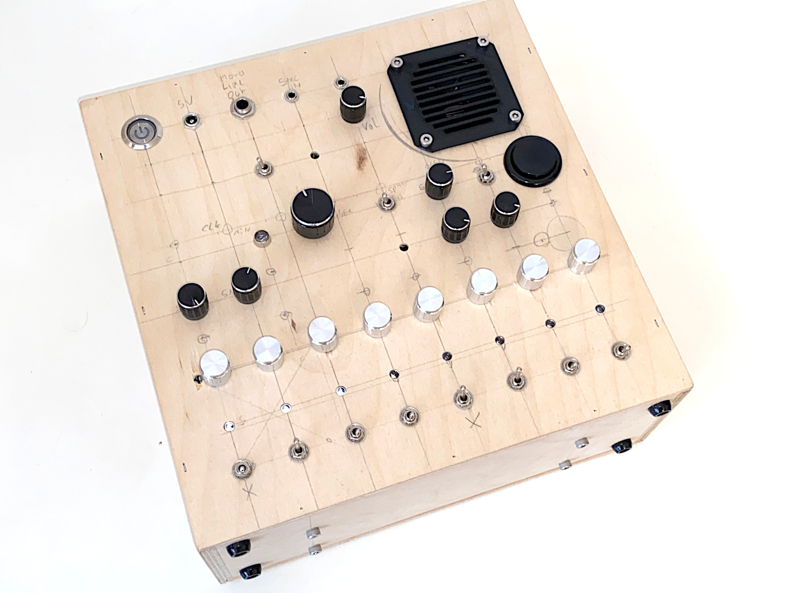

# Atari Punk Synth

This is a simple synthesizer based on the popular **Atari Punk Console** design. In addition it features:
* 8-Step Sequencer
* Echo/Reverb unit
* Sync-In (incl. frequency divider) for other analog synthesizers
* Sync-Out (repeating Sync-In only at this time)
* Manual Clock
* Internal Speaker
* Line-Out

## Rough from the inside and outside.

...check out the [Gallery](GALLERY.md).

## How does it perform?

https://youtu.be/FOUyAVAhYBA

## Sources

I thank all the great people out there creating fantastic circuits and sharing them with the world. Here are the most important sources I used:

Atari Punk Console with 8-Step Sequencer using two 555 and one CD4017 can be found here http://www.owyheesound.com/sequencer.php or here https://electro-music.com/forum/topic-37770-125.html This circuit diagram circulates in different versions. Be sure to pick the "November 4th, 2009" version.

Echo circuit, using PT2399: https://www.petervis.com/guitar-circuits/pt2399/testing-and-troubleshooting.html

Switch Debounce, using a 555: http://www.555-timer-circuits.com/switch-debounce.html

Frequency Divider, using a CD4017: https://www.electronicshub.org/frequency-divider-circuit/

## Circuit -- WARNING!

**WARNING!**

I tried to create one single circuit diagram putting it all together. I tried to write down everything quite carefully. However I am not 100% sure that everything is correct. Please take it as an inspiration, think and think twice and be skeptical! This circuit diagram may contain errors. If you're going to build your own Atari Punk Synth, recheck everything and if you encounter any mistakes please let me know. Building circuits following this design is on your own risk!

### Potentiometer Modules

The potentiometer module was drawn only for step 1. Just replicate seven times for each step.

### Known Problems

* The capacitor in Switch Debounce seems to be too small. Switch still bounces.
